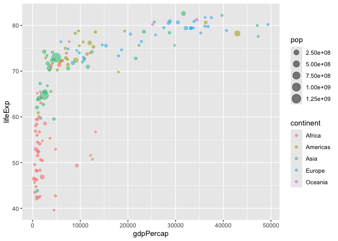

# Class 5: Data Viz with ggplot
Sophia Wang (A16838155)

## Plotting in R

R has lot’s of ways to make plots and figures. This includes so-called
**base** graphics and packages like **ggplot2**

``` r
plot(cars)
```


This is a **base** R plot of the in-built `cars` dataset that has only
two columns:

``` r
head(cars)
```

      speed dist
    1     4    2
    2     4   10
    3     7    4
    4     7   22
    5     8   16
    6     9   10

> Q.How would we plot this wee dataset with **ggplot2**?

All ggplot figures have at least 3 layers:

- **data**
- **aes** (how the data ap to the plot)
- **deoms** (how we draw the pot, lines, points, etc.)

Before I use any new package I need to download and install it with the
`install.packages()` command.

I never use `install.packages()` within my quarto document otherwise I
wiill install the package over and over and over again - which is silly!

Once a package is installed I can ,load it up with the `library()`
function.

``` r
# install.packages("ggplot2")
library(ggplot2)
ggplot(cars)+
  aes(x=speed,y=dist)+
  geom_point()
```


**Key points**: For simple plots (like the one above) ggplot is more
verbose (we need to do more typing) but as plots get more complicated,
ggplot starts to be more clear and simple than base R plot()

``` r
p<-ggplot(cars)+
  aes(x=speed,y=dist)+
  geom_point()+
  geom_smooth(method="lm",se=FALSE)+
  labs(title="Stopping distance of old cars",subtitle="From the in-built cars dataset")+
  theme_bw()
```

``` r
p
```

    `geom_smooth()` using formula = 'y ~ x'


``` r
url <- "https://bioboot.github.io/bimm143_S20/class-material/up_down_expression.txt"
genes <- read.delim(url)
head(genes)
```

            Gene Condition1 Condition2      State
    1      A4GNT -3.6808610 -3.4401355 unchanging
    2       AAAS  4.5479580  4.3864126 unchanging
    3      AASDH  3.7190695  3.4787276 unchanging
    4       AATF  5.0784720  5.0151916 unchanging
    5       AATK  0.4711421  0.5598642 unchanging
    6 AB015752.4 -3.6808610 -3.5921390 unchanging

> Q Use the nrow() function to find out how many genes are in this
> dataset. What is your answer?

``` r
nrow(genes)
```

    [1] 5196

> Q Use the colnames() function and the ncol() function on the genes
> data frame to find out what the column names are (we will need these
> later) and how many columns there are. How many columns did you find?

``` r
colnames(genes)
```

    [1] "Gene"       "Condition1" "Condition2" "State"     

``` r
ncol(genes)
```

    [1] 4

> Q Use the table() function on the State column of this data.frame to
> find out how many ‘up’ regulated genes there are. What is your answer?

``` r
table(genes$State)
```


          down unchanging         up 
            72       4997        127 

> Q Using your values above and 2 significant figures. What fraction of
> total genes is up-regulated in this dataset?

``` r
round( table(genes$State)/nrow(genes)*100, 2 )
```


          down unchanging         up 
          1.39      96.17       2.44 

The key functions here were: `nrows()`and `ncol()` `table()` is very
useful for getting counts finally `round()`

A first plot:

``` r
ggplot(genes)+
  aes(Condition1, Condition2)+
  geom_point(col="blue",alpha=0.4)
```


``` r
p2<-ggplot(genes)+
  aes(Condition1, Condition2,col=State)+
  geom_point()
p2
```


``` r
p2+
  scale_colour_manual( values=c("blue","gray","red") )+
  labs(title="Gene Expresion Changes Upon Drug Treatment",
         x="Control (no drug) ",
         y="Drug Treatment")
```


``` r
# File location online
url <- "https://raw.githubusercontent.com/jennybc/gapminder/master/inst/extdata/gapminder.tsv"

gapminder <- read.delim(url)
library(dplyr)
```


    Attaching package: 'dplyr'

    The following objects are masked from 'package:stats':

        filter, lag

    The following objects are masked from 'package:base':

        intersect, setdiff, setequal, union

> Q How many years are in this dataset?

``` r
length(gapminder$year)
```

    [1] 1704

``` r
table(gapminder$year)
```


    1952 1957 1962 1967 1972 1977 1982 1987 1992 1997 2002 2007 
     142  142  142  142  142  142  142  142  142  142  142  142 

``` r
length(unique(gapminder$year))
```

    [1] 12

> Q Extract data for the US in 1992

``` r
filter(gapminder,country=="United States")
```

             country continent year lifeExp       pop gdpPercap
    1  United States  Americas 1952  68.440 157553000  13990.48
    2  United States  Americas 1957  69.490 171984000  14847.13
    3  United States  Americas 1962  70.210 186538000  16173.15
    4  United States  Americas 1967  70.760 198712000  19530.37
    5  United States  Americas 1972  71.340 209896000  21806.04
    6  United States  Americas 1977  73.380 220239000  24072.63
    7  United States  Americas 1982  74.650 232187835  25009.56
    8  United States  Americas 1987  75.020 242803533  29884.35
    9  United States  Americas 1992  76.090 256894189  32003.93
    10 United States  Americas 1997  76.810 272911760  35767.43
    11 United States  Americas 2002  77.310 287675526  39097.10
    12 United States  Americas 2007  78.242 301139947  42951.65

``` r
filter(gapminder,country=="United States",year==1992)
```

            country continent year lifeExp       pop gdpPercap
    1 United States  Americas 1992   76.09 256894189  32003.93

> Q What is the population of Ireland

``` r
max(filter(gapminder,country=="Ireland")$year)
```

    [1] 2007

``` r
filter(gapminder,country=="Ireland",year==2007)
```

      country continent year lifeExp     pop gdpPercap
    1 Ireland    Europe 2007  78.885 4109086     40676

> Q What countries in dataset had pop smaller than Ireland in 2007

- First limit/subset the dataset to the year 2007
- Then find the `pop` value for Ireland
- Then extract all rows with `pop` less than Ireland’s

``` r
all_country <- filter(gapminder,year==2007)
pop_Ireland <- filter(gapminder,country=="Ireland",year==2007)$pop
countries_smaller<-all_country$country[all_country$pop<pop_Ireland]
length(countries_smaller)
```

    [1] 31

> Q Complete the code below to produce a first basic scater plot of this
> gapminder_2007 dataset:

``` r
gapminder_2007 <- gapminder %>% filter(year==2007)
```

``` r
ggplot(gapminder_2007) +
  aes(x=gdpPercap, y=lifeExp, color=continent, size=pop) +
  geom_point(alpha=0.5)
```



``` r
ggplot(gapminder_2007) + 
  aes(x = gdpPercap, y = lifeExp, color = pop) +
  geom_point(alpha=0.8)
```


``` r
ggplot(gapminder_2007) + 
  aes(x = gdpPercap, y = lifeExp, size = pop) +
  geom_point(alpha=0.5)
```


``` r
ggplot(gapminder_2007) + 
  geom_point(aes(x = gdpPercap, y = lifeExp,
                 size = pop), alpha=0.5) + 
  scale_size_area(max_size = 10)
```


> Q Can you adapt the code you have learned thus far to reproduce our
> gapminder scatter plot for the year 1957? What do you notice about
> this plot is it easy to compare with the one for 2007?

``` r
gapminder_1957 <- gapminder %>% filter(year==1957)
ggplot(gapminder_1957)+
  aes(x=gdpPercap,y=lifeExp,color=continent,size=pop)+
  geom_point(alpha=0.7)+
  scale_size_area(max_size = 15)
```


> Q Do the same steps above but include 1957 and 2007 in your input
> dataset for ggplot(). You should now include the layer
> facet_wrap(~year) to produce the following plot:

``` r
gapminder_1957_2007<- gapminder %>% filter(year==1957 | year==2007)
ggplot(gapminder_1957_2007)+
  aes(x=gdpPercap,y=lifeExp,color=continent,size=pop)+
  geom_point(alpha=0.7)+
  scale_size_area(max_size = 15)+
  facet_wrap(~year)
```


