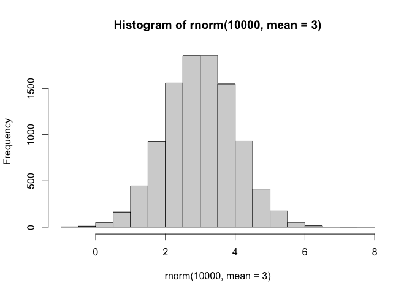

# Class 7 Machine Learning I
Sophia Wang A16838155

Today we are going to learn how to apply different machine learning
methods, beginning with clustering:

The goal here is to find groups/clusters in your input data.

First I will make up some data with clear groups. For this I will use
the `rnorm()` function:

``` r
rnorm(10)
```

     [1]  1.15722447 -0.26838887 -0.34397798  1.20427815 -1.08587910  0.53259469
     [7] -0.58518122 -0.02968096  1.61105983  0.70154518

``` r
hist(rnorm(10000,mean=3))
```



``` r
n=30
x <- c(rnorm(n,-3),rnorm(n,3))
y <- rev(x)
z <- cbind(x,y)
head(z)
```

                 x        y
    [1,] -2.417259 4.641272
    [2,] -3.373535 2.447809
    [3,] -1.623621 3.768233
    [4,] -2.581117 2.229499
    [5,] -3.612071 2.149931
    [6,] -4.138206 3.405212

``` r
plot(z)
```


Use the `kmeans()` function setting k to 2 and nstart=20 Inspect/print
the results \>Q. How many points are in each cluster? \>Q. What
‘component’ of your result object details - cluster size? - cluster
assignment/membership? - cluster center?

> Q. Plot z colored by the kmeans cluster assignment and add cluster
> centers as blue points

``` r
km <- kmeans(z,centers=2)
km
```

    K-means clustering with 2 clusters of sizes 30, 30

    Cluster means:
              x         y
    1  3.141357 -3.080032
    2 -3.080032  3.141357

    Clustering vector:
     [1] 2 2 2 2 2 2 2 2 2 2 2 2 2 2 2 2 2 2 2 2 2 2 2 2 2 2 2 2 2 2 1 1 1 1 1 1 1 1
    [39] 1 1 1 1 1 1 1 1 1 1 1 1 1 1 1 1 1 1 1 1 1 1

    Within cluster sum of squares by cluster:
    [1] 59.52918 59.52918
     (between_SS / total_SS =  90.7 %)

    Available components:

    [1] "cluster"      "centers"      "totss"        "withinss"     "tot.withinss"
    [6] "betweenss"    "size"         "iter"         "ifault"      

Results in kmeans object `km`

``` r
attributes(km)
```

    $names
    [1] "cluster"      "centers"      "totss"        "withinss"     "tot.withinss"
    [6] "betweenss"    "size"         "iter"         "ifault"      

    $class
    [1] "kmeans"

Cluster size?

``` r
km$size
```

    [1] 30 30

Cluster assignment/membership?

``` r
km$cluster
```

     [1] 2 2 2 2 2 2 2 2 2 2 2 2 2 2 2 2 2 2 2 2 2 2 2 2 2 2 2 2 2 2 1 1 1 1 1 1 1 1
    [39] 1 1 1 1 1 1 1 1 1 1 1 1 1 1 1 1 1 1 1 1 1 1

Cluster centers?

``` r
km$centers
```

              x         y
    1  3.141357 -3.080032
    2 -3.080032  3.141357

> Q. Plot z colored by the kmeans cluster assignment and add cluster
> centers as blue points

``` r
plot(z,col="red")
```


R will re-cycle the shorter color vector to be the same length as the
longer (number of data points) in z

``` r
plot(z,col=c("red","blue"))
```


``` r
plot(z,col=c(1,2))
```


``` r
plot(z,col=km$cluster)
```


We can use the `points()`function to add new points to an existsing
plot…like the cluster centers.

``` r
plot(z,col=km$cluster)
points(km$centers,col="blue",pch=15,cex=3)
```


> Q. Can you run kmeans and ask for 4 clusters please and plot the
> results like we have done above?

``` r
km <- kmeans(z,4)
plot(z,col=km$cluster)
points(km$centers,col="blue",pch=15,cex=1.5)
```


\##Hierarchical Clustering

Let’s take our same made-up data `z` and see how hclust works.

First we need a distance matirx of our data to be clustered.

``` r
d <- dist(z)
hc <- hclust(d)
hc
```


    Call:
    hclust(d = d)

    Cluster method   : complete 
    Distance         : euclidean 
    Number of objects: 60 

``` r
plot(hc)
abline(h=8,col="red")
```


I can get my cluswter membership vector by “cutting the tree” with the
`cluster()` function like so:

``` r
grps <- cutree(hc,h=8)
```

Can you plot `z` colored by our hclust results:

``` r
plot(z,col=grps)
```


\##PCA of UK food data Read data from the UK on food consumption in
different parts of the UK.

``` r
url <- "https://tinyurl.com/UK-foods"
x <- read.csv(url,,row.names=1)
head(x)
```

                   England Wales Scotland N.Ireland
    Cheese             105   103      103        66
    Carcass_meat       245   227      242       267
    Other_meat         685   803      750       586
    Fish               147   160      122        93
    Fats_and_oils      193   235      184       209
    Sugars             156   175      147       139

``` r
barplot(as.matrix(x), beside=T, col=rainbow(nrow(x)))
```


``` r
barplot(as.matrix(x), beside=FALSE, col=rainbow(nrow(x)))
```


A so-called `Paris` plot can be useful for small datasets like this

``` r
pairs(x, col=rainbow(10), pch=16)
```


It’s hard to see structure and trends in even this small dataset. How
will we eer do this when we have big datasets with 1,000 or 10s of
thousands of things we are measuring…

\##PCA to the rescue

Let’s see how PCA deals with this dataset. So main function in base R to
do PCA is called `prcomp()`

``` r
pca <- prcomp(t(x))
summary(pca)
```

    Importance of components:
                                PC1      PC2      PC3       PC4
    Standard deviation     324.1502 212.7478 73.87622 2.921e-14
    Proportion of Variance   0.6744   0.2905  0.03503 0.000e+00
    Cumulative Proportion    0.6744   0.9650  1.00000 1.000e+00

Let’s see what is inside this `pca` object that we created from running
`prcomp()`

``` r
attributes(pca)
```

    $names
    [1] "sdev"     "rotation" "center"   "scale"    "x"       

    $class
    [1] "prcomp"

``` r
pca$x
```

                     PC1         PC2        PC3           PC4
    England   -144.99315   -2.532999 105.768945 -9.152022e-15
    Wales     -240.52915 -224.646925 -56.475555  5.560040e-13
    Scotland   -91.86934  286.081786 -44.415495 -6.638419e-13
    N.Ireland  477.39164  -58.901862  -4.877895  1.329771e-13

``` r
plot(pca$x[,1],pca$x[,2], col=c("black","red","blue","darkgreen"),pch=16,xlab="PC1 (67.4%)",ylab="PC2 (29%)")
```


``` r
plot(pca$x[,1],pca$x[,2], col=c("black","red","blue","darkgreen"),pch=16,xlab="PC1 (67.4%)",ylab="PC2 (29%)")
text(pca$x[,1], pca$x[,2], colnames(x),col=c("black","red","blue","darkgreen"))
```


``` r
## Lets focus on PC1 as it accounts for > 90% of variance 
par(mar=c(10, 3, 0.35, 0))
barplot( pca$rotation[,1], las=2 )
```


