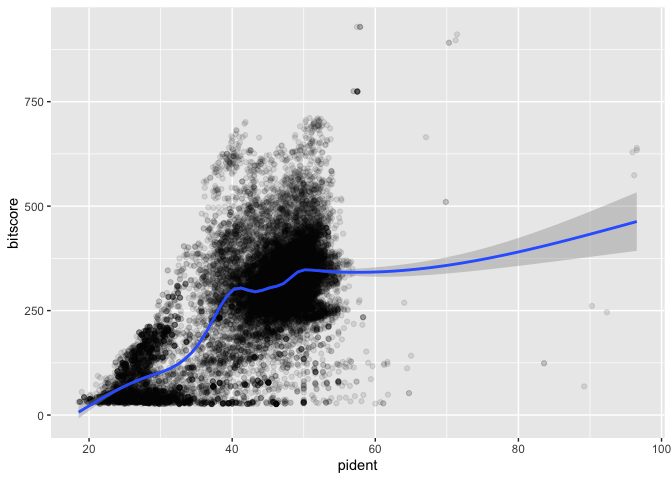

# Class16 (Unix Basics)
Sophia Wang (A16838155)

\##Using remote AWS instance (Part II)

Transfer results back to computer

*Local Analysis*

``` r
rs<-read.table("myresult.tsv",col.names = c("qseqid", "sseqid", "pident", "length", "mismatch", "gapopen", "qstart", "qend", "sstart", "send", "evalue", "bitscore"))
head(rs)
```

           qseqid         sseqid pident length mismatch gapopen qstart qend sstart
    1 NP_598866.1 XP_009294521.1 46.154    273      130       6      4  267    420
    2 NP_598866.1 NP_001313634.1 46.154    273      130       6      4  267    476
    3 NP_598866.1 XP_009294513.1 46.154    273      130       6      4  267    475
    4 NP_598866.1 NP_001186666.1 33.071    127       76       5      4  126    338
    5 NP_598866.1 NP_001003517.2 30.400    125       82       4      4  126    344
    6 NP_598866.1 NP_001003517.2 30.645     62       41       2     53  113     43
      send   evalue bitscore
    1  684 1.73e-63    214.0
    2  740 4.60e-63    214.0
    3  739 4.78e-63    214.0
    4  459 5.28e-12     67.8
    5  465 2.37e-11     65.9
    6  103 4.00e-01     33.9

``` r
library(ggplot2)
ggplot(rs, aes(pident, bitscore)) + geom_point(alpha=0.1) + geom_smooth()
```

    `geom_smooth()` using method = 'gam' and formula = 'y ~ s(x, bs = "cs")'


